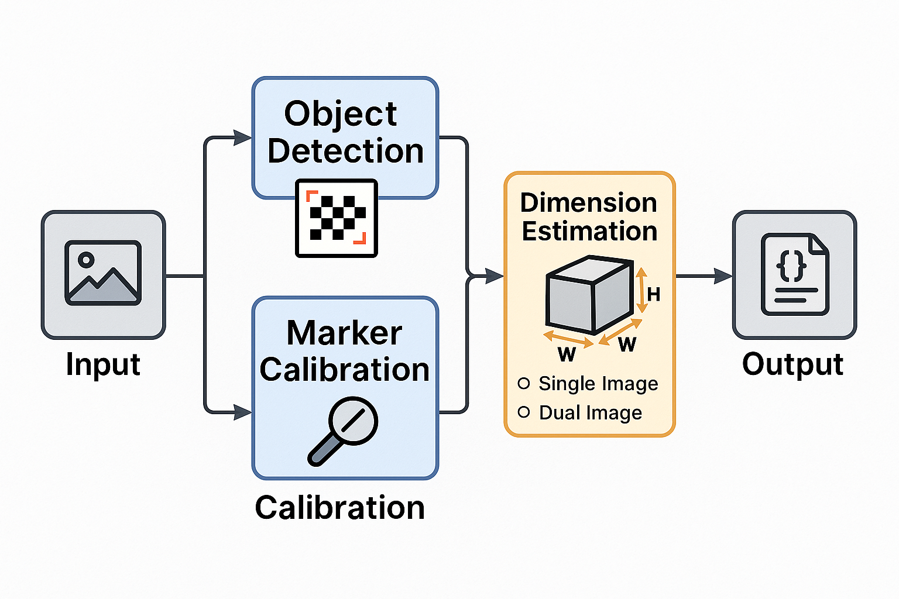

# 📏 Visual Measurement Toolkit (VMT)

A computer vision-based toolkit that estimates real-world dimensions of objects in images using ArUco markers for scale calibration and AI-based object detection. The system supports both single-view and dual-view (two-angle) inputs to calculate height, width, and depth of physical objects.

---

## 📌 Overview

**Visual Measurement Toolkit (VMT)** is an AI-powered measurement system designed to extract object dimensions from photographs using reference markers. The application supports multiple object types and configurations and provides a fast, reliable, and contactless method to measure real-world items — useful in logistics, quality control, and inventory scenarios.

> ⚠️ This repository contains only the README and architectural flow for understanding the system design. No datasets, models, or code are included due to company restrictions.

---

## 🔁 Key Features

- 🧠 **AI-Based Object Detection** – Uses YOLO and custom SSD models to detect known and unknown objects
- 🧲 **Marker-Based Calibration** – Uses ArUco markers with known real-world dimensions to derive pixel-to-cm/inch ratio
- 📷 **Single-View Estimation** – Calculates 2D dimensions (length, width or height) from one image
- 🔄 **Dual-View Estimation** – Combines two adjacent images to estimate all 3 dimensions
- 🧪 **Real-Time Output** – Displays estimated object dimensions on the image itself
- 🌐 **Web-Based Access** – Hosted locally with a lightweight web UI for easy input and result display

---

## 🧠 Architecture


*Note: Temporary architecture — final version coming soon.*

---

## 🛠 Tech Stack

| Component         | Tool/Library              |
|------------------|---------------------------|
| Language          | Python                    |
| Detection Models  | YOLOv11, SSD (custom)     |
| Image Processing  | OpenCV                    |
| Marker Tracking   | ArUco (OpenCV)            |
| Web Interface     | Streamlit                 |

---

## 🎯 Objective

To automate the measurement of object dimensions using computer vision techniques and remove manual intervention from size estimation processes. The system ensures precision by leveraging known-size reference markers (ArUco) for calibration.

---

## 🔄 Pipeline Overview

1. **📥 Image Upload**  
   Users upload either one image or two adjacent-side images of an object with a visible ArUco marker.

2. **🔎 Object Detection**  
   The system detects the object using pretrained YOLO or custom SSD models.

3. **📐 Marker Calibration**  
   ArUco marker is detected and its known real-world size is compared to its pixel size to compute the calibration factor.

4. **📏 Dimension Calculation**  
   - **Single-View** → Width + Height  
   - **Dual-View** → Width + Height + Depth

5. **🖼️ Visual Output**  
   The output image is annotated with bounding boxes and real-world dimension labels.

---

## 📥 Example Output (Simulated)

```json
{
  "object": "Box",
  "dimensions_cm": {
    "width": 40.2,
    "height": 28.5,
    "depth": 16.1
  },
  "confidence": 0.92,
  "reference_marker": "ArUco Original",
  "calibration_ratio": 0.1342  
}
```

---

## 🧾 Use Cases

- ✅ **E-commerce Product Scanning**  
  Automatically extract package dimensions for shipping labels.

- ✅ **Manufacturing QC**  
  Detect size discrepancies between expected vs actual product dimensions.

- ✅ **Warehouse Automation**  
  Measure boxes and items for space optimization or stacking.

- ✅ **Retail Inventory**  
  Validate sizes of tagged items using just an image + reference card.

---

## 🔒 Disclaimer

This repository demonstrates a professional-grade application structure and processing pipeline.  
It **does not include** proprietary data, production-trained models, or confidential credentials.  
You are free to adapt the structure, pipeline logic, and modular components for educational, testing, or private deployments.

---

## 👨‍💻 Author

**Goutham Sidhik**  
AI/ML Engineer | Computer Vision & GenAI Developer  
[LinkedIn](https://www.linkedin.com/in/goutham-sidhik-amuluru-50231b163/)

---
